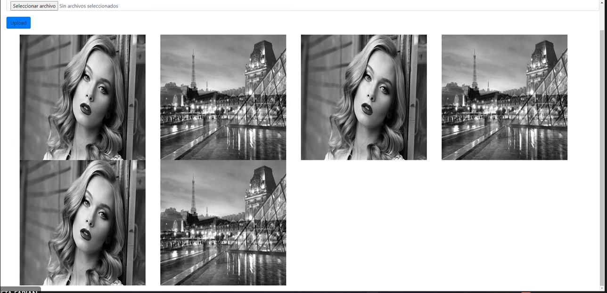

<p align="center">

</p>


**Online Boutique** is a cloud-first microservices demo application.
Online Boutique consists of 4 microservices application. The application is a
web-based ai analyzer app where users can upload photos and be analyze by the 
vision api of google cloud.

This application works on any Kubernetes cluster, as well as Google
Kubernetes Engine. It’s **easy to deploy with little to no configuration**.


## Screenshots

 Home Page                                                                                                          
 [](./docu/webapp.png) 

## Quickstart (GKE)


1. **Download minikube** 
Follow the next step in the page: https://minikube.sigs.k8s.io/docs/start/ 

2. **Clone this repository.**

```
git clone https://github.com/sharingplay/MArayaSOA_P2.git
cd MArayaSOA_P2
```

3. **Run the app**

- run the command in your cms

```
./restart-minikube.bat
```


5. **Wait for the Pods to be ready.**

```
kubectl get pods
```

After a few minutes, you should see:

```
NAME                                READY   STATUS    RESTARTS      AGE
emotions-service-6c6f769fb7-5qcmf   1/1     Running   3 (18m ago)   20m
frontend-555c9cf688-dxdtx           1/1     Running   0             20m
mysql-7c4c75c868-6tplw              1/1     Running   1 (19m ago)   20m
rabbitmq-0                          1/1     Running   0             20m
```

## Architecture

**Online Boutique** is composed of 4 microservices written in different
languages that talk to each other over some api.

The architecture is based on broker, that means that the meassage is asynchronous using rabbitMQ

[](./docu/Arquitectura.png)


| Service                                              | Language      | Description                                                                                                                       |
| ---------------------------------------------------- | ------------- | --------------------------------------------------------------------------------------------------------------------------------- |
| [frontend](./src/frontend)                           | Angular            | Exposes an HTTP server to serve the website. Does not require signup/login. |
| [DataBase](./src/cartservice)                        | MySQL            | Stores the items of the image in the data base.                                                           |
| [Analyzer](./src/productcatalogservice)              | Vision API            | Analyze the emotion of the person in the image.                        |
| [Broker](./src/currencyservice)                      | RabbitMQ       | Connect all the services with a queue. |


